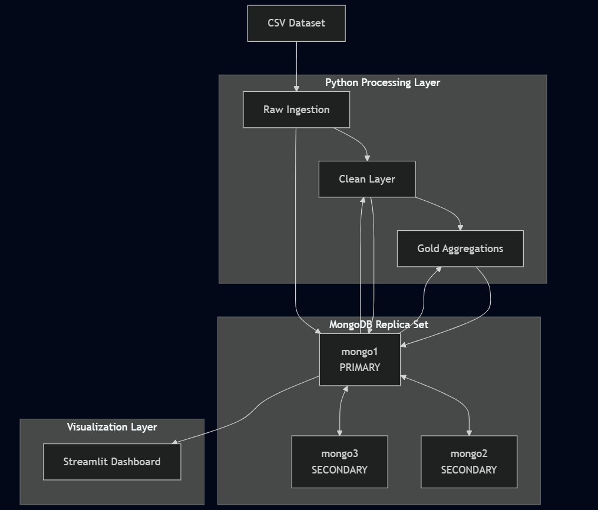
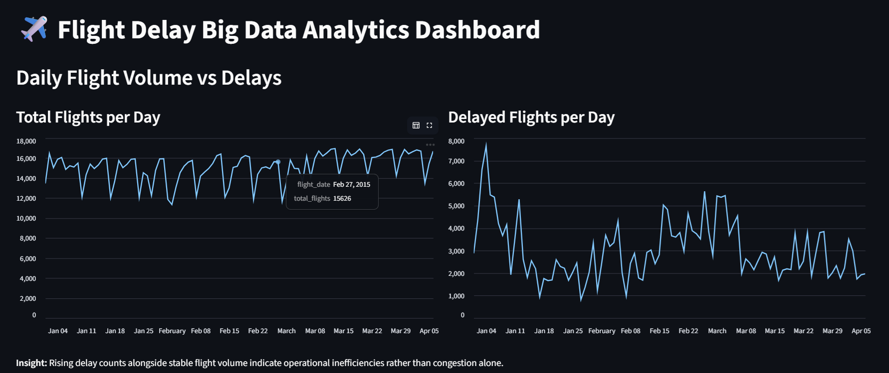
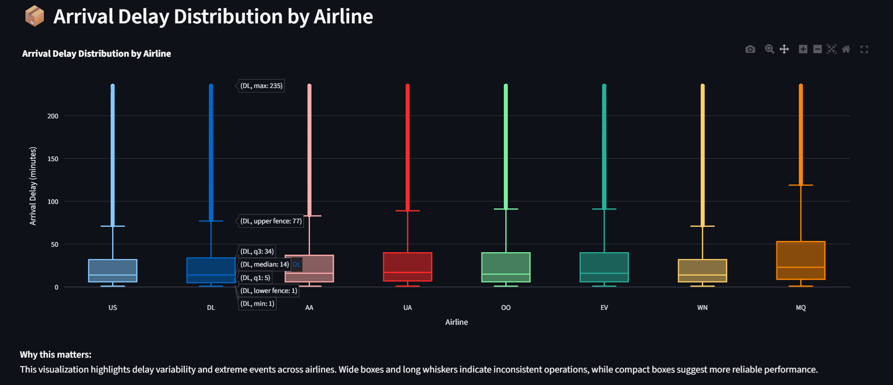
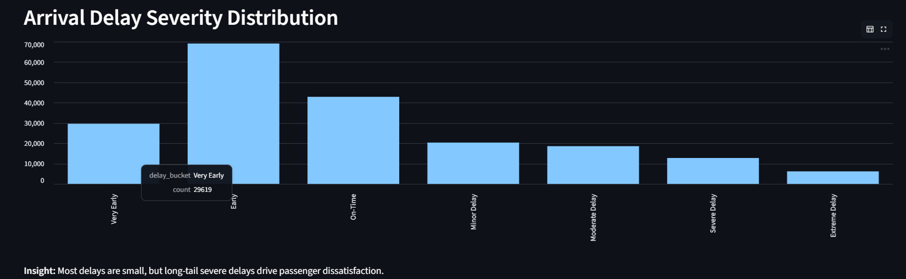
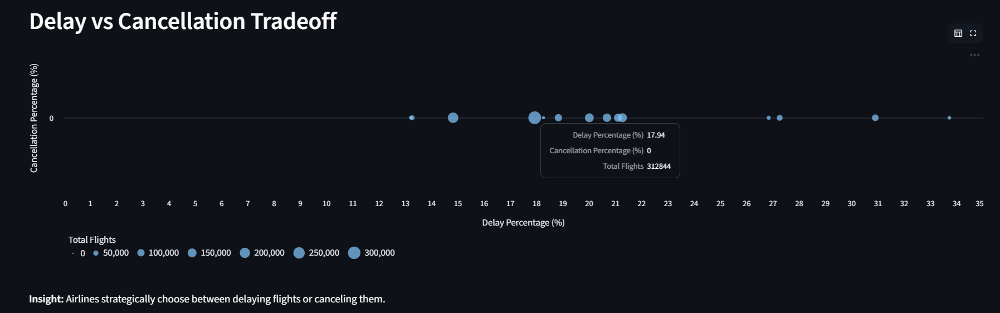
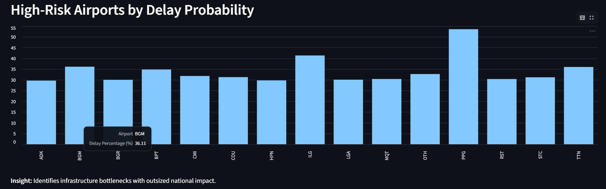
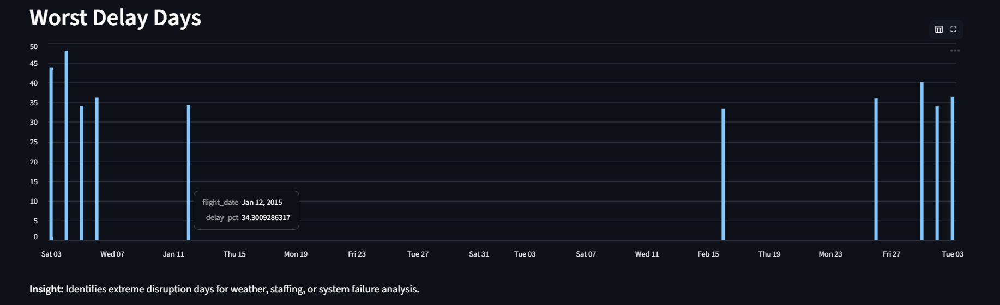

# AeroDelay Analytics

## Overview

**AeroDelay Analytics** is an end-to-end **distributed Big Data analytics pipeline** designed to analyze U.S. domestic flight delays at scale.  
The system ingests over **5.8 million flight records**, processes them through structured **Raw → Clean → Gold** layers, and serves analytics-ready insights via an interactive **Streamlit dashboard**.

This project demonstrates real-world **Big Data engineering practices**, including distributed storage, scalable ingestion, schema validation, database-native aggregation, and production-style visualization.


---

## Dataset

- **Source:** Kaggle - U.S. DOT Flight Delays (2015)
- **Link:** https://www.kaggle.com/datasets/usdot/flight-delays
- **Files Used:**
  - `flights.csv` (~5.8M rows)
  - `airlines.csv`
  - `airports.csv`
- **Format:** CSV
- **Key Fields:**
  - Flight date
  - Airline
  - Flight number
  - Origin airport
  - Destination airport
  - Departure delay
  - Arrival delay
  - Cancellation flag

---

## Architecture & System Design

AeroDelay Analytics is deployed as a **distributed Big Data system** using **Docker Compose** and a **MongoDB replica set**.  
The architecture follows a layered data design to ensure scalability, data quality, and analytics readiness.

---

### Distributed Data Platform

- **Database:** MongoDB 6.0
- **Deployment:** Docker Compose
- **Cluster Type:** 3-node **Replica Set**

**Replica Set Configuration:**
- `mongo1` - Primary
- `mongo2` - Secondary
- `mongo3` - Secondary

This setup provides:
- High availability
- Fault tolerance
- Data replication
- Scalable read access

All Raw, Clean, and Gold datasets are stored directly in MongoDB collections.

---

### Processing Layer

The processing layer is implemented in **Python** and executed as independent pipeline stages:

- Raw ingestion using chunked inserts
- Cleaning and schema validation
- Aggregations using MongoDB aggregation pipelines

Engineering features:
- **Pydantic** for schema validation
- **Mypy** for static type checking
- **Structured logging**
- **PyTest** for pipeline validation

---

### Visualization Layer

Analytics-ready datasets from the Gold layer are consumed directly by a **Streamlit dashboard**.

- No flat files are used
- All charts query MongoDB collections
- Visualizations are rendered using **Plotly** for responsiveness

---

## Architecture Diagram

The diagram below illustrates the full end-to-end data flow and the distributed MongoDB deployment.



---

## Pipeline Layers

### 1) Raw Layer (Bronze)

- Ingests CSV data **as-is** into MongoDB
- Uses **chunked ingestion (100,000 rows per batch)** for scalability

**Collections:**
- `raw_flights`
- `raw_airlines`
- `raw_airports`

**Row Counts:**
- Flights: ~5.8M
- Airlines: 14
- Airports: ~322

---

### 2) Clean Layer (Silver)

- Processes a **1.5M representative sample** of flight records

**Cleaning Steps:**
- Handle missing delay values
- Normalize airline and airport codes
- Standardize flight dates
- Derive delay and cancellation indicators
- Validate schema using **Pydantic**
- Remove duplicates using a composite key

**Output Collection:**
- `clean_flights` (~1.45M rows)

---

### 3️) Aggregated Layer (Gold)

Aggregations are computed **directly inside MongoDB** and materialized as collections:

1. **Daily Flight Summary** (`agg_daily_flight_summary`)
   - Total flights
   - Delayed flights
   - Cancelled flights
   - Average arrival delay

2. **Airline Performance** (`agg_airline_performance`)
   - Percentage delayed
   - Percentage cancelled
   - Average arrival delay

3. **Airport Delay Statistics** (`agg_airport_delay_stats`)
   - Percentage of delayed departures
   - Average departure delay

These collections are optimized for dashboard performance.

---

## Dashboard

- **Tool:** Streamlit
- **Data Source:** MongoDB Gold-layer collections
- **Visualizations Include:**
  - Flight volume vs delayed flights (time series)
  - Airline delay percentage comparison
  - Delay severity distribution
  - Delay vs cancellation tradeoff
  - High-risk airports by delay probability
  - Heatmaps and box plots for delay analysis
 
  ### Dashboard Screenshots














Run locally:

streamlit run dashboard/app.py


## Project Structure

```
flight-delay-bigdata-pipeline/
│── docker-compose.yml
│── README.md
│
├── data/
│   └── raw/
│       ├── flights.csv
│       ├── airlines.csv
│       └── airports.csv
│
├── src/flight_pipeline/
│   ├── config/
│   ├── db/
│   ├── models/
│   ├── pipeline/
│   └── logging_config.py
│
├── dashboard/
│   └── app.py
│
└── tests/
```

---

## Key Technologies

* MongoDB (Replica Set)
* Docker & Docker Compose
* Python (Pandas, PyMongo, Pydantic)
* Streamlit

---

## Summary

This project demonstrates a **production-style Big Data architecture** with distributed storage, scalable ingestion, schema validation, database-native analytics, and interactive visualization, all implemented using open-source tools and real-world data.


